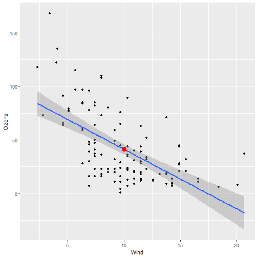
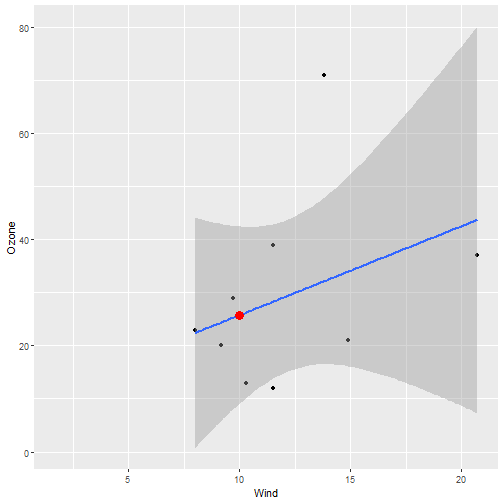

<style>
.section .reveal .state-background {
    background: skyblue;}
.section .reveal h1,
.section .reveal p {
    color: black;
    position: relative;
    top: 4%;}
    
.reveal h1, .reveal h2, .reveal h3 {
  word-wrap: normal;
  -moz-hyphens: none;
}
.small-code pre code {
  font-size: 1em;
}
.midcenter {
    position: fixed;
    top: 50%;
    left: 50%;
}
.footer {
    color: black; background: skyblue;
    position: fixed; top: 90%;
    text-align:center; width:100%;
}
.pinky .reveal .state-background {
  background: #FF69B4;
} 
.pinky .reveal h1,
.pinky .reveal h2,
.pinky .reveal p {
  color: black;
}
</style>


Shiny App Pitch Presentation
========================================================
author: Lei Cheng 
date: 1/25/2019
font-family: 'Helvetica'
transition: concave
<div class="midcenter" style="margin-left:-120px; margin-top:-80px;">
</img>
</div>
<div class="footer" style="margin-top:-50px;font-size:80%;">
R code for the Shiny App at <a href="https://github.com/lzcheng/JHUDSS09-Developing-Data-Product.git">https://github.com/lzcheng/JHUDSS09-Developing-Data-Product.git</a></div>

Project Overview
========================================================
incremental: true
1. This project builds a regression model on the relationship between Ozone and Wind Speed from the dataset `airquality`.
2. The ShinyApp provides an interactive interface to allow users to select the month(s) of interest and build regression models on the selected month(s). The different models show the potentially different relationships between Ozone and Wind Speed at different months and invite further investigation into possible confounders such as temperature etc.
3. The ShinyApp allows users to choose a wind speed and use the regression model to predict the ozone level.
4. The users have options to show/hide the confidence intervals, the predicted point on the graph and also the subsetted data table.


Regression on the whole data set
========================================================
class: small-code

```r
library(tidyverse)
ggplot(airquality, aes(x=Wind, y=Ozone))+geom_point()+geom_smooth(method=lm,se=T)+
  geom_point(aes(x=10, y=predict(lm(Ozone ~ Wind, data = airquality), newdata = data.frame(Wind = 10))),colour="red",size=4)
```



Regression on selected month(s)
========================================================
class: small-code

```r
selectedMonth<-filter(airquality, Month %in% c(6))
ggplot(selectedMonth, aes(x=Wind, y=Ozone))+geom_point()+geom_smooth(method=lm,se=T)+
   geom_point(aes(x=10, y=predict(lm(Ozone ~ Wind, data = selectedMonth), newdata = data.frame(Wind = 10))),colour="red",size=4)
```




Regression on selected month(s)
========================================================
class: small-code

```r
selectedMonth<-filter(airquality, Month %in% c(7,8))
ggplot(selectedMonth, aes(x=Wind, y=Ozone))+geom_point()+geom_smooth(method=lm,se=T)+
   geom_point(aes(x=10, y=predict(lm(Ozone ~ Wind, data = selectedMonth), newdata = data.frame(Wind = 10))),colour="red",size=4)
```


